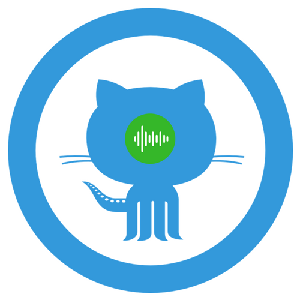

<h1 align="center">
  
  <h3 align="center">Github Trending on Google Assistant</h3>
</h1>

A Google Assistant Action (with an invocation name of "Github Trending") which tells you the trending repositories on Github and more. More information on [Google Assistant Explore](https://assistant.google.com/services/a/uid/0000000c678c0923?hl=en-US).

## How to use

Just say "Talk to Github Trending" to your Google Assistant on either Android, iPhone or Google Home.

## Tech

* Use [Dialogflow](https://dialogflow.com/) to build actions(you can think it as Voice command and interaction).
* Use [Firebase functions](https://firebase.google.com/) to handle voice command and give response.

## Features

Here are some examples:

* `Tell me the trending repositories on Github today/this week/this month.` will tell you the repositories on [Github Trending page](https://github.com/trending). After you here every repository, you can say `Next` to go to next one, or say "I like it" or "star it" to star the repository(which will require you to do authentication first).

* `What's the trending today for Typescript?` will tell you the trending repositories today for Typescript language.

* `I need some help.` will give you some help on supported command.

> Note: you don't need to say the commands with exactly the same words as above, Google's Machine Learning training model will learn it and provide certain level of fault tolerance.

## Screenshots

<h1 align="center">
  
  
</h1>
